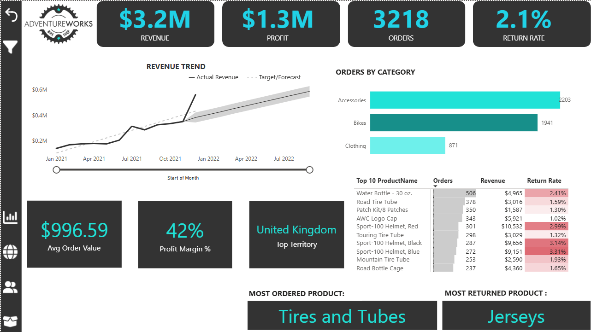
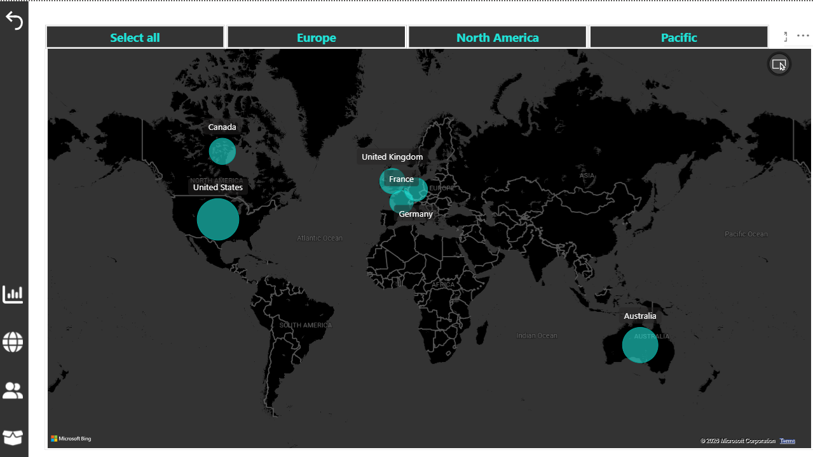
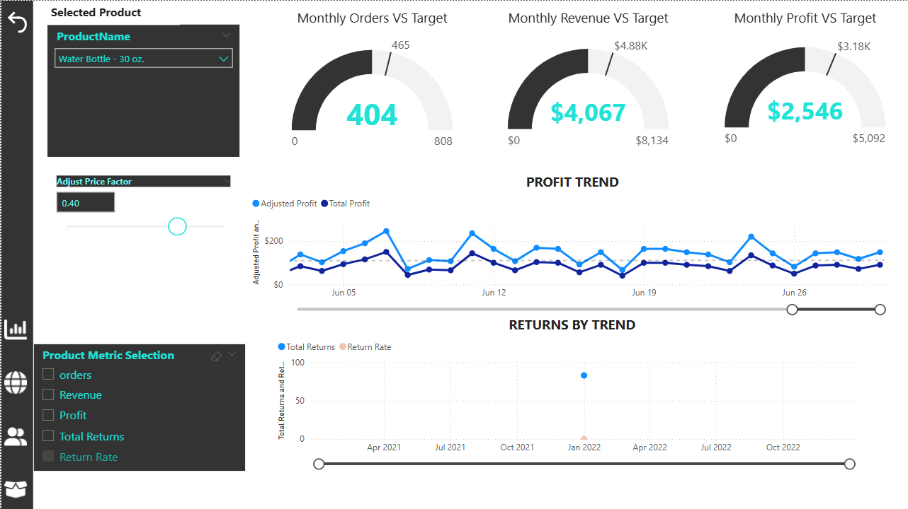
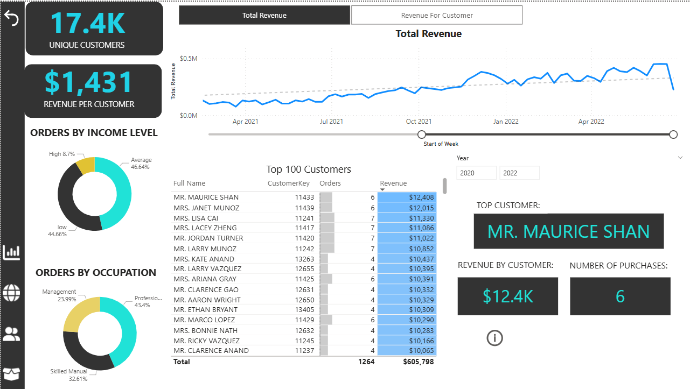

# AdventureWorks Sales Analysis - Power BI Dashboard

## Overview

An interactive Power BI dashboard analyzing AdventureWorks sales performance, product trends, and customer behavior across multiple regions. Built using DAX measures, dynamic visuals, and drill-through functionality across 3 years of sales data (2020-2022).

## Dashboard Pages

- Executive Summary - KPIs including Revenue ($3.2M), Profit ($1.3M), Orders (3,218), and Return Rate (2.1%)

- Map View - Geographic sales distribution across the USA, UK, Australia, Canada, France, and Germany

- Product Detail - Product-level performance with profit trends, return analysis, and price adjustment simulation

- Customer Detail - Customer segmentation by income level and occupation, with top customer insights

## Screenshots

## Dataset

| Table | Description | Rows |
|-------|-------------|------|
| Sales 2020 | Transaction data for 2020 | 2,630 |
| Sales 2021 | Transaction data for 2021 | 23,935 |
| Sales 2022 | Transaction data for 2022 | 29,481 |
| Returns | Product return records | 1,809 |
| Customer Lookup | 18,154 unique customers with demographics | 18,154 |
| Product Lookup | Product details including cost and price | 293 |
| Territory Lookup | 10 sales territories across 6 countries | 10 |
| Calendar Lookup | Date dimension table | - |
| Product Categories | 4 product categories | - |
| Product Subcategories | Product subcategory mapping | - |

## Data Model

- Fact Tables: Sales Data (2020-2022), Returns Data

- Dimension Tables: Customer, Product, Territory, Calendar, Product Categories, Product Subcategories

- Relationships: Star schema connecting all dimension tables to fact tables via key fields

## Key Insights

- The United Kingdom is the top-performing territory

- Accessories are the most ordered category with 2,203 orders

- Water Bottle - 30 oz. is the top-selling product with 506 orders

- Tires and Tubes are the most ordered product category

- Average order value of $996.59 with 42% profit margin

- 17.4K unique customers with $1,431 average revenue per customer

## Tools & Technologies

- Microsoft Power BI Desktop

- DAX (Data Analysis Expressions)

- Data Modeling (Star Schema)

- Interactive Visualizations & Drill-through

## How to Open

1. Download the Teritory.pbix file from the report folder

2. Open with Microsoft Power BI Desktop

3. Explore the interactive dashboard across all pages

## Author

Manoj Sai Kumar Pedarla | Data Analyst | [LinkedIn](https://www.linkedin.com/in/manojpedarla)
